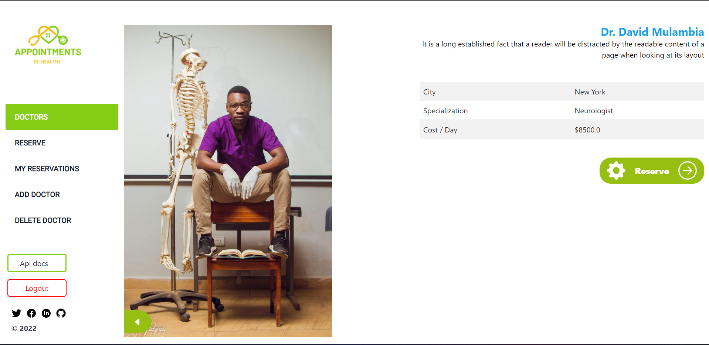
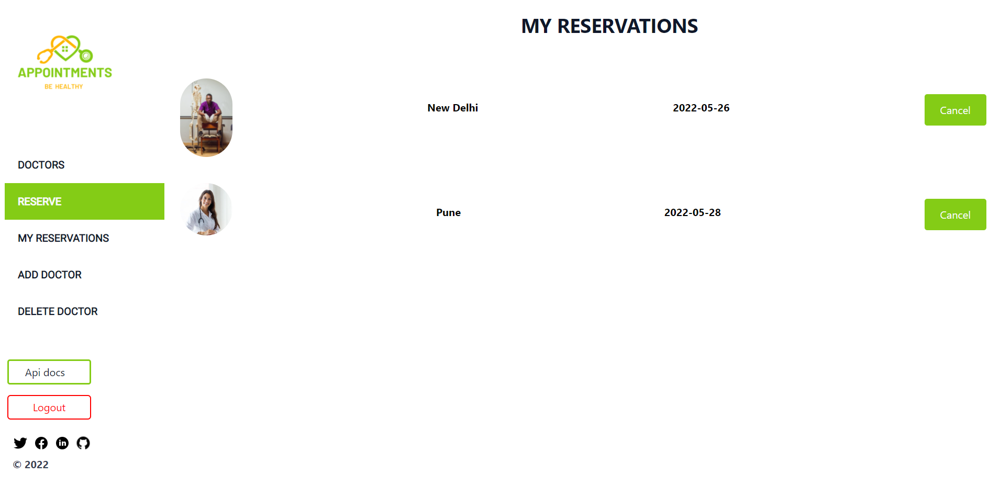

# Book Appoinments Frontend

> Book Appoinments frontend is react forntend application for doctor book appoinemnts. This applications is responsive and users can load, create, and delete doctors and reservations. Users need to sign up or sign in to access application. They can sign up or sign in using the sign up and login forms.

## Link to the backend

[Book Appoinments Backend](https://github.com/Chimwemwe-127001/book-appointment-backend)

## Kanban Board
[Kanban Board](https://github.com/users/Chimwemwe-127001/projects/3)

## Initial state of kanban board
[Initial Kanban Board](https://github.com/Chimwemwe-127001/book-appointment-frontend/issues/13)

> ***We are a group of five***
1. Team 1 - [Chimwemwe-127001](https://github.com/Chimwemwe-127001)
2. Team 2 - [Ranjeet](https://github.com/thecodechaser )
3. Team 3 - [Ellis](https://github.com/mwanawabangona)
4. Team 4 - [Ritta](https://github.com/Buyaki01)
5. Team 5 - [Anselem](https://github.com/AnselemOdims )

## Preview:

### Home Page


### Details Page



### Book Appoinments Page


### Appointments Page



## Built With

- HTML
- CSS
- Tailwind
- Bootstrap
- JavaScript
- REACT
- Redux
- Webpack
- Jest

## Live version

[Book-Appoinments](https://book-appointments-frontend.netlify.app)

## Getting Started

To get a local copy up and running follow these simple example steps.

### Prerequisites
- A text editor(preferably Visual Studio Code)
- Node
- Web browser

### Install
- [Git](https://git-scm.com/downloads)
- [Node](https://nodejs.org/en/download/)

### Using it Locally

- Clone the project

```bash 
git clone git@github.com:Chimwemwe-127001/book-appointment-frontend.git

cd book-appointment-frontend
```

- Install dependencies

```bash
npm i 
or
npm install
```
- To Start the development server
```bash
npm start
```

- To test the project
```bash
npm run test
```


## Visit And Open Files

[Visit Repo](https://github.com/Chimwemwe-127001/book-appointment-frontend)

## Download Repo

[Download Repo](https://github.com/Chimwemwe-127001/book-appointment-frontend/archive/refs/heads/main.zip)

## Authors

👤 **Ranjeet Singh**

- GitHub: [@thecodechaser](https://github.com/thecodechaser)
- Twitter: [@thecodechaser](https://twitter.com/thecodechaser)
- LinkedIn: [thecodechaser](https://linkedin.com/in/thecodechaser)

👤 **ANSELEM ODIMEGWU**

- GitHub: [@AnselemOdims](https://github.com/AnselemOdims)
- LinkedIn: [Anselem Odimegwu](https://www.linkedin.com/in/anselem-odimegwu/)
- Email: anselemcloud@gmail.com

👤 **Chimwemwe Sinyinza**

- GitHub: [@Chimwemwe-127001](https://github.com/Chimwemwe-127001)
- Twitter: [@chimwewme](https://twitter.com/chimwewme)

👤 **Ritta Sweta**

- Linkedin: [@ritta-sweta](https://www.linkedin.com/in/ritta-sweta/)
- Github: [@Buyaki01](https://github.com/Buyaki01)
- Twitter: [@BuyakiRitta](https://twitter.com/BuyakiRitta)

👤 **mwanawabangona**

- Github : [@mwanawabangona](https://github.com/mwanawabangona)
- Twitter : [@Ellis_ahh](https://twitter.com/Ellis_ahh)
- LinkedIn: [LinkedIn](https://www.linkedin.com/in/ellis-ngona)


## 🤝 Contributing

Contributions, issues, and feature requests are welcome!

Feel free to check the [issues page](https://github.com/Chimwemwe-127001/book-appointment-frontend/issues).

## Show your support

Give a ⭐️ if you like this project!

## Acknowledgments

- Inspired by original design for Creative Commons by [Murat Korkmaz](https://www.behance.net/muratk) on [Behance](https://www.behance.net/gallery/26425031/Vespa-Responsive-Redesign).
- Inspiration: Microverse

## 📝 License

This project is [MIT](./LICENSE.md) licensed.
